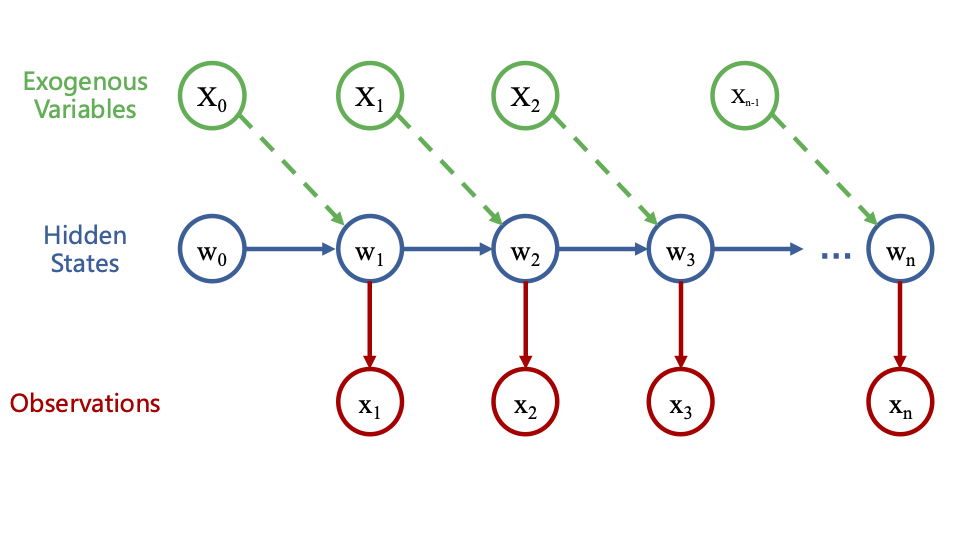

# Robust-PI-Kalman-NN
**Forecasting under Time-Series Reconstructed Stochastic Dynamics**

This repository accompanies my MSc thesis and implements a hybrid econometric–machine learning framework for commodity price forecasting and volatility inference. The case study focuses on aluminium futures, but the code is designed to be extensible to other assets. The model can also be extended to any kind of derivatives, the only thing need to do is to adjust the emission equation of EKF for certain structure.

---

## Table of Contents
- [Overview](#overview)
- [Mathematical Foundations](#mathematical-foundations)
  - [CARMA](#carma-continuous-time-arma)
  - [GARCH](#garch-conditional-volatility)
  - [BSM](#black–scholes–merton-bsm-pricing)
  - [HMM / State-Space Transformation](#hidden-markov-model-hmm--state-space-transformation)
  - [EKF with Fixed-Lag Smoothing](#extended-kalman-filter-ekf-with-fixed-lag-smoothing)
- [Features](#features)
- [Repository Structure](#repository-structure)
- [Installation](#installation)
- [Quick Start](#quick-start)
- [Results](#results)
- [Citation](#citation)
- [Acknowledgements](#acknowledgements)
- [License](#license)

---

## Overview
The project integrates:
- **CARMA** for continuous-time dynamics of log prices,
- **GARCH** for conditional volatility and clustering,
- **BSM** for risk-neutral pricing consistency,
- **HMM/state-space** representation for probabilistic filtering,
- **EKF + Fixed-Lag Smoothing (FLS)** for nonlinear latent-state estimation,
- (Optional) **PINN** residuals to enforce no-arbitrage,
- (Optional) **Variational Inference (VI)** for Bayesian parameter learning.

Notation used throughout:
- Price $ S_t $, log-price $ X_t = \log S_t $,
- Log return $ r_t = X_t - X_{t-1} $,
- Risk-neutral rate $ r^Q $,
- Constant terms $ c $ are included in model specifications.

---

## Mathematical Foundations

### CARMA (Continuous-time ARMA)
CARMA(p,q) models describe continuous-time dynamics of $X_t = \log S_t$:
$$
a(D) X_t = b(D)\, \dot{W}_t,\quad 
a(D)=D^p+a_1 D^{p-1}+\cdots+a_p,\quad 
b(D)=b_0+b_1 D+\cdots+b_q D^q,
$$
where $ \dot{W}_t $ is Gaussian white noise (formal derivative of Wiener process).  
For implementation, we use an equivalent **state-space** form:
$$
\mathrm{d}w_t = A w_t\,\mathrm{d}t + B\,\mathrm{d}W_t,\qquad
X_t = C w_t,
$$
with $ (A,B,C) $ determined by $(a,b)$. This links time-series structure to SDEs amenable to filtering.

---

### GARCH (Conditional Volatility)
To capture volatility clustering in $ r_t $:
$$
r_t = c + \epsilon_t,\quad \epsilon_t\sim\mathcal{N}(0,\sigma_t^2),\qquad
\sigma_t^2 = \omega + \alpha\,\epsilon_{t-1}^2 + \beta\,\sigma_{t-1}^2,
$$
typically GARCH(1,1) with $ \omega>0,\alpha,\beta\ge 0 $ and $ \alpha+\beta<1 $.  
In the hybrid model, GARCH can drive the latent volatility state that feeds the measurement/transition noise of the state-space system.

---

### Black–Scholes–Merton (BSM) Pricing
Under $ \mathbb{Q} $ (risk-neutral measure):
$$
\mathrm{d}S_t = r^Q S_t\,\mathrm{d}t + \sigma S_t\,\mathrm{d}W_t^{\mathbb{Q}},
$$
implying $ \mathrm{e}^{-r^Q t} S_t $ is a martingale.  
We use this as a **no-arbitrage anchor** for PINN-style residuals and for mapping physical-measure dynamics to risk-neutral quantities where needed for option valuation.

---

### Hidden Markov Model (HMM) / State-Space Transformation


Discretizing the continuous model yields a (generally nonlinear) state-space system:
$$
w_{t+1} = f(w_t, X_t, \epsilon_p),\qquad
x_t = g(w_t, \epsilon_m),
$$
- $w_t$: latent states (e.g., CARMA state vector, latent log-volatility),
- $X_t$: exogenous drivers (possibly transformed by a neural network),
- $x_t$: observed series (e.g., $ r_t $ or $ \log S_t $),
- $\epsilon_p, \epsilon_m$: process and measurement noise.  
This admits an **HMM** interpretation, enabling recursive Bayesian estimation.

---

### Extended Kalman Filter (EKF) with Fixed-Lag Smoothing
For nonlinear $f,g$, EKF linearizes about the current estimate:
$$
\Psi_t = \left.\frac{\partial f}{\partial w}\right|_{\hat{w}_{t|t}},\quad
\Phi_t = \left.\frac{\partial h}{\partial w}\right|_{\hat{w}_{t|t-1}}.
$$
**Predict:**
$$
\hat{w}_{t|t-1} = f(\hat{w}_{t-1|t-1}),\quad
P_{t|t-1}=\Phi_{t-1} P_{t-1|t-1} \Phi_{t-1}^\top + R_{t-1}.
$$
**Update:**
$$
K_t = P_{t|t-1} \Phi_t^\top\big(\Phi_t P_{t|t-1} \Phi_t^\top + S_t\big)^{-1},
$$
$$
\hat{w}_{t|t} = \hat{w}_{t|t-1} + K_t\big(x_t - g(\hat{w}_{t|t-1})\big),
$$
$$
P_{t|t} = (I - K_t \Phi_t)\, P_{t|t-1}\, (I - K_t \Phi_t)^\top + K_t S_t K_t^\top
\quad\text{(Joseph form)}.
$$
**Fixed-Lag Smoothing (FLS)** refines past states \( \hat{w}_{t-\ell|t} \) using information up to time \(t\), reducing one-step lag in predictions and improving latent volatility tracking.

---

## Features
- Hybrid **CARMA–GARCH–NN** with **state-space/HMM** formulation  
- **EKF + FLS** for nonlinear latent-state estimation  
- Optional **PINN** no-arbitrage residuals and **VI** for Bayesian inference  
- Rolling-window backtests; baseline comparisons (ARIMA/GARCH/NN)  
- Clean modular code for extending assets, exogenous drivers, and filters

---

## Repository Structure
```text
├─ data/                # Raw & processed datasets (paths or loaders)
├─ experiments_output/  # The experiment outputs containing full dataset testing and rolling-window testing results.
├─ output_img/          # Visualizations for one-year length experiments
├─ README.md
├─ LICENSE.             # License for this repository
├─ fast_train.py.       # Code for 
├─ model.py             # The main python code containing the EKF component and variational parameter bank for VI
└─

```
---

## Installation
```bash
# clone
git clone https://github.com/YitongGong99/Robust-PI-Kalman-NN.git

# (recommended) create env
python -m venv .venv
source .venv/bin/activate      # Windows: .venv\Scripts\activate

# install
pip install -U pip
pip install -r requirements.txt

```

---
## Quick Start
```bash
# Run tests on the whole dataset
python run.py

# Run tests on specific condition (for example)
python fast_train.py --NN_ON 1 --NN_TYPE GRU --PINN_WEIGHT 0.5 --ELBO_WEIGHT 1 --VI 1 --Year 2017
```

---
## Results
See [full dataset and rolling window test results](./experiment_output/)


---
## Citation
If you use this work, please cite:

 ```
@mastersthesis{gong2025,
  title  = {Robust PI-Kalman-NN Forecasting under Time-Series Reconstructed Stochastic Dynamics},
  author = {Yitong Gong},
  school = {University College London},
  year   = {2025}
}
```

---

## Acknowledgements
This work was carried out as part of my MSc in Data Science and Machine Learning at UCL.  

I would like to thank my supervisors Prof. John Shawe-Taylor and Dr. Tristan Fletcher and my previous training in Financial Mathematics at LSE, which provided a solid foundation for this research.

---
## License
See [LISENCE](./LICENSE)